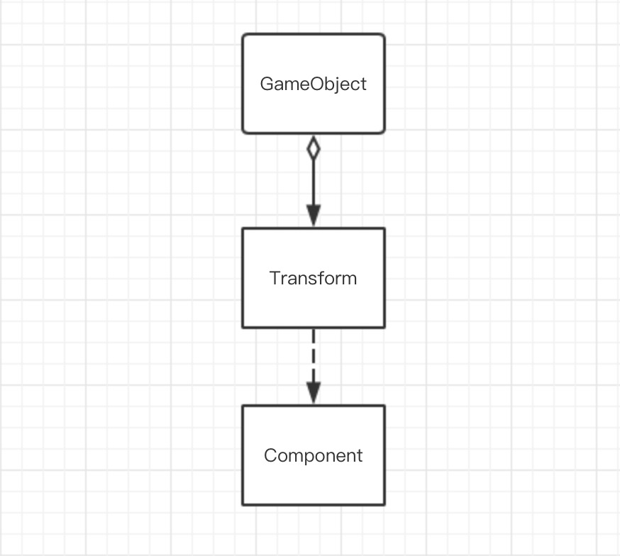

# 简答题

- 解释 游戏对象（GameObjects） 和 资源（Assets）的区别与联系
  - 区别
    - 游戏对象
    > 游戏对象是游戏场景中的所有实体的统称。它不仅包含游戏中的实体，同时也包含摄像机、光源等。正是他们之间的互动构成了游戏。
    - 资源
    > 资源包含材质、音乐、脚本等等，他们通常附着于游戏对象而发挥作用，但同时，也包含可以直接实例化为游戏对象的对象的预制。
  - 联系
    > 资源可以附着在游戏对象上，也可以实例化为对象而发挥作用，但是独立的资源不能直接发挥作用。
- 下载几个游戏案例，分别总结资源、对象组织的结构（指资源的目录组织结构与游戏对象树的层次结构）
  - 资源目录结构
  > 资源目录一般下属多个文件夹以区分不同的资源类型，如预制、材质、场景、脚本、音乐等，在文件夹下放置对应的资源，如此方便制作者对不同资源的管理。
  - 游戏对象树结构
  > 如同资源目录一般，根据用途被划分为几个大的空对象，来区分不同的游戏对象。实际起作用的对象作为这些对象的子对象而存在。常见的花粉中包含：光源、背景、实体、边界、事件、文字、摄像机等。
- 编写一个代码，使用 debug 语句来验证 MonoBehaviour 基本行为或事件触发的条件
  - 基本行为包括 Awake() Start() Update() FixedUpdate() LateUpdate()
  - 常用事件包括 OnGUI() OnDisable() OnEnable()

  ```CS
    using System.Collections;
    using System.Collections.Generic;
    using UnityEngine;

    public class BehaviourTest : MonoBehaviour {

    void Start () {
        Debug.Log ("Test: Start!");
    }

    void Update () {
        Debug.Log ("Test: Update!");
    }

    private void Awake() {
        Debug.Log ("Test: Awake!");
    }

    private void FixedUpdate() {
        Debug.Log ("Test: FixedUpdate!");
    }

    private void LateUpdate() {
        Debug.Log ("Test: LateUpdate!");
    }

    private void OnGUI() {
        Debug.Log ("Test: OnGUI!");
    }

    private void OnDisable() {
        Debug.Log ("Test: OnDisable!");
    }

    private void OnEnable() {
        Debug.Log ("Test: OnEnable!");
    }
  }
  ```

  - 结论：结合代码测试结果和官方文档解释得出
    - Start: 在脚本被启用情况下的第一帧被调用，先于所有的Update
    - Update: 在每一帧都被调用
    - Awake: 在脚本被实例化并加载时就调用，调用顺序在Start之前
    - FixedUpdate: 在每个时间片，而不是每一帧调用
    - LastUpdate: 在Update被调用后调用
    - OnGUI: 在GUI事件被触发时调用
    - OnDisable: 在脚本被禁用时调用，仅在状态切换时调用，保持时不调用
    - OnEnable: 在脚本被启用时调用，仅在状态切换时调用，保持时不调用

- 查找脚本手册，了解 GameObject，Transform，Component 对象
  - 分别翻译官方对三个对象的描述（Description）
    - GameObject
      > Scripting: 在Unity场景中的所有实体的基类。
      >
      > Manual: 游戏对象在Unity中是那些表现角色、道具和场景基础对象。他们本身并不十分完整，但她们作为组件（Components）的容器而存在，这使得她们得以实现她们真正的功能。
    - Transform
      > Scripting: 一个对象的位置、旋转（角度）和缩放。每个对象都有一个Transform。它被用于存储、和操作对象的位置、旋转角和缩放。 每个Transform都有一个父元素，这允许分层地应用这些属性。这也就是在层级窗口所呈现的层级。
      >
      > Manual: Transform组件决定了场景中每个对象的位置、旋转（角度）和缩放。每个游戏对象都有一个Transform。
    - Component
      > Scripting: 所有附着于游戏对象类的东西的基类。
  - 描述下图中 table 对象（实体）的属性、table 的 Transform 的属性、 table 的部件
    - table
      > 类为 GameObject
      >
      > bool activeSelf = true
      >
      > int layer 为默认值（Default)
      >
      > string tag = "" (Untagged)
      >
      > bool isStatic = false
    - table's Transform
      > 类为 Transform
      >
      > Vector3 Position = new Vector3 (0,0F, 0.0F, 0.0F)
      >
      > Quaternion rotation = new Quaternion (0.0F, 0.0F, 0.0F, 1)
      >
      > Vector3 localScale = new Vector3 (1, 1, 1)
    - table's components
      > 基类均为 Components
      >
      > class MeshFilter
      >
      > - Mesh mesh = cube
      >
      > class BoxCollider
      >
      > - bool isTrigger = false
      >
      > - PhysicMaterial material = null
      >
      > - Vector3 Center = new Vector3 (0.0F, 0.0F, 0.0F)
      >
      > - Vector3 Size = new Vector3 (1, 1, 1)
      >
      > class MeshRenderer
      >
      > - Rendering.ShadowCastingMode shadowCastingMode = On
      >
      > - bool receiveShadows = true
      >
      > - MotionVectorGenerationMode motionVectorGenerationMode = Object
      >
      > - Rendering.LightProbeUsage lightProbeUsage = BlendProbes
      >
      > - Rendering.ReflectionProbeUsage reflectionProbeUsage = BlendProbes
      >
      > - GameObject lightProbeProxyVolumeOverride = null

  - 用 UML 图描述 三者的关系
      > 
- 整理相关学习资料，编写简单代码验证以下技术的实现：
  - 查找对象
    > ```cs
    > static GameObject Find (string name) // 通过对象名来查找单个对象
    > static GameObject FindWithTag (string tag) // 通过对象的tag来查找单个对象
    > static GameObject[] FindGameObjectsWithTag (string tag) // 通过对象的tag来寻找所有对象
    > static Object FindObjectOfType(Type type) // 通过对象的类型来寻找对象
    > static Object[] FindObjectsOfType(Type type) // 通过对象的类型来寻找所有的对象
    > ```
  - 添加子对象
    > ```cs
    > GameObject parentObj = GameObject.Find([ParentName]);
    > GameObject childObj = GameObject.Find([ChildName]);
    > childObj.transform.parent = parentObj.transform;
    > 
    > ```
  - 遍历对象树
    > 如前文所属，FindObjectsOfType函数可以通过对象类型寻找对象，因而将其type令为GameObject即可得到所有的对象的一个列表，遍历列表即可遍历整个对象树
    > ```cs
    > for (var obj in GameObject.FindObjectsOfType(typeof(GameObject))) {
    > // your code here
    > }
    > ````
  - 清除所有子对象
    > ```cs
    >  for (int i = 0; i < transform.childCount; i++) {
    >       Destroy (transform.GetChil(i).gameObject);
    >}
    > ```
    > 此处值得说明的是，在Destory之后，childCount并不会立即减少，
- 资源预设（Prefabs）与 对象克隆 (clone)
  - 预设（Prefabs）有什么好处？
    > 1. 提高设计的复用性，降低设计成本
    > 1. 提高资源的复用性，降低游戏空间复杂度
    > 1. “类化”游戏对象，提高逻辑复用性
    > 1. 变相提供相对统一的设计风格
  - 预设与对象克隆 (clone or copy or Instantiate of Unity Object) 关系？
    > 1. 二者都可以创造一类相同／相似的对象
    > 1. 由同个预设创造的对象在预设更改时也会同步更改，但是克隆出来的对象是互相独立的
  - 制作 table 预制，写一段代码将 table 预制资源实例化成游戏对象
    > ```cs
    > GameObject prefab = Resources.Load("Prefabs/table") as GameObject;
    > GameObject instance = Instantiate(prefab);
    > ```
- 尝试解释组合模式（Composite Pattern / 一种设计模式
  > 是一种树状层级式的组织结构，它允许使用者递归地处理对象间的关系。在这种模式下，复杂对象和简单对象被一视同仁——复杂对象的内部细节对外部是隐藏的，从而使得客户程序与复杂元素的内部结构解耦。一个形象的例子是计算机的文件系统——文件夹和单个文件从外部看都是一致的。
- 使用 BroadcastMessage() 方法向子对象发送消息
  > ```cs
  > // 父类对象通过BroadcastMessage方法发送字符串消息，子类对象的同名方法将被调用
  > this.BroadcastMessage("Hey"); // 父类对象发出消息
  > /*---*/
  > void Hey(){
  > // This part will be executed
  > } // 子类对象同名方法将被调用
  > ```